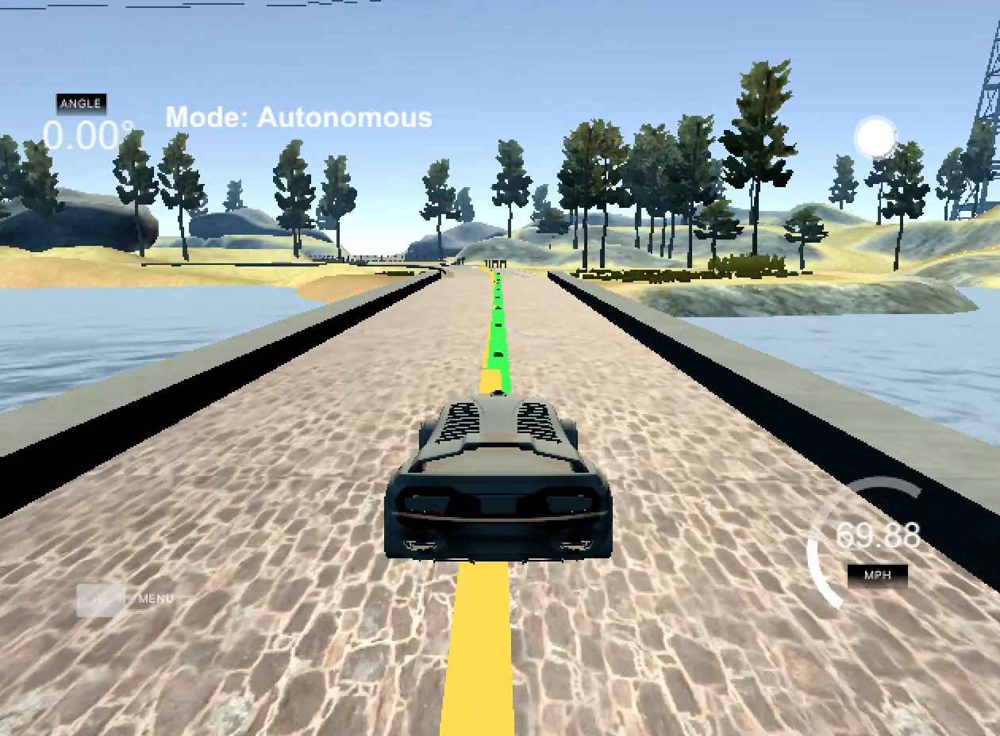

# Model Predictive Control
### William Rifenburgh

---

## Description

This is a project on Model Predictive Control (MPC). In the project an autonomous driving car is given and is expected to follow
waypoints that track the center of a race course. Using the car's heading, speed and position, an MPC controller controls the throttle/braking and steering angle of the car to navigate the track. The MPC can do so with a 100 millisecond delay in controls actuation as the model used in the MPC controller can model the effects of latency and optimize for minimal error.

## The Model

The model of the system plant is as follows:

```cpp

fg[1 + x_start + t] = x1 - (x0 + v0 * CppAD::cos(psi0) * dt);
fg[1 + y_start + t] = y1 - (y0 + v0 * CppAD::sin(psi0) * dt);
fg[1 + psi_start + t] = psi1 - (psi0 + v0 * delta0 / Lf * dt);
fg[1 + v_start + t] = v1 - (v0 + a0 * dt);
fg[1 + cte_start + t] = cte1 - ((f0 - y0) + (v0 * CppAD::sin(epsi0) * dt));
fg[1 + epsi_start + t] = epsi1 - ((psi0 - psides0) + v0 * delta0 / Lf * dt);

```

Where...

- `x` denotes the x position of the vehicle in __m__,
- `y`: denotes the y position of the vehicle in __m__,
- `psi` denotes the orientation of the vehicle in __radians__,
- `v` denotes velocity magnitude in __m/s__,
- `a` denotes acceleration magnitude in __m/s²__,
- `cte` denotes the Cross-Track-Error in __m__,
- `epsi` denotes orientation error in __radians__,
- `delta` denotes the steering angle of car in __radians__,
- `Lf` denotes an approximation of the distance from the center of the front wheels to the car's center of mass,

and the suffix `des` denotes 'desired' and `0` and `1` refer to time step.

The model's state variables are all calculated in the car's frame where X points in the direction it is traveling, Y points to its driver's side and `psi` __in the model__ is the angle between the X axis in the counter-clockwise direction. This is not to be confused with the `psi` provided from the simulation which is positive in the clockwise direction and is the angle between the car's reference frame and the global coordinate system.

## Polynomial Fitting and MPC Preprocessing

The simulation by Udacity accepts vectors of coordinate data in local car frame X and Y to display yellow and green lines that represent the desired trajectory and MPC projected trajectory respectively. This requires conversion between the global frame position data given to us from the simulation to the car's frame. `Ai`, the inverse of a homogenous transformation matrix shown below was used to convert from global frame to car frame.

```cpp

//Transformation Matrix for car frame to global frame
Eigen::MatrixXd A(3,3);
A << cos(psi), -sin(psi), px,
      sin(psi), cos(psi), py,
            0,        0,  1;
//Take the inverse
Eigen::MatrixXd Ai(A.inverse());

//Transform waypoints from global to carframe to plot yellow line
Eigen::VectorXd ptsx_carframe(ptsx.size());
Eigen::VectorXd ptsy_carframe(ptsy.size());
for(int i=0; i<ptsx.size(); i++){

  Eigen::VectorXd pt_globalframe(3);
  Eigen::VectorXd pt_carframe(3);
  pt_globalframe << ptsx[i], ptsy[i], 1;
  pt_carframe = Ai * pt_globalframe;

  ptsx_carframe[i] = pt_carframe[0];
  ptsy_carframe[i] = pt_carframe[1];

}

```

In addition to converting reference frame, unit conversions were necessary as well. The speed was converted from `mph` to `mps`.
```cpp
v *= 0.44704;
```
And the acceleration was converted from the unitless throttle parameter of range [-1,1] to `m/s²`

```cpp
a *= 2.98027;
```
This conversion factor was estimated by flooring the throttle (setting throttle to its max acceleration) in the simulation and measuring the time required to reach 60 mph. This came out to be about 9 seconds. Thus 60[mph]/9[s] * 0.44704[m/mph] = 2.98027[m/s²]

## Model Predictive Control with Latency

To model and counter the control actuation delay, the MPC optimizer was fed an initial state that was actually the predicted state of the vehicle 100 milliseconds into the future. The code snippet below shows how the initial state was updated.

```cpp
//Add delay and then send to MPC
//Ordering matters here
double Lf = 2.67;
double delay = 0.100;
double x0 = v * delay;
double psi0 = v * delta / Lf * delay;
double v0 = v + a * delta;
double cte0 = polyeval(coeffs, x0);
double epsi0 = -atan(coeffs[1] + 2 * coeffs[2] * x0 + 3 * coeffs[3] * x0 * x0) - psi0;

Eigen::VectorXd state(6);
state << x0, 0.0, psi0, v0, cte0, epsi0;
```

`coeffs` in the above code were the polynomial coefficients of the waypoint 3rd order polynomial in car frame.

## Timestep Length and Elapsed Duration, N & dt

The timestep length `dt` and number of time steps calculated into the future `N` by the MPC were initially chosen to be `N=10` and `dt=0.1`. This resulted in behavior that was marginally stable. If introduced to a sudden error, the MPC would cause the car to continuously oscillate around the center of the road and paint the waypoint line on the opposite side of it. Increasing `dt` to 0.2 made the oscillation settle quickly and allowed to MPC to plan further ahead.

## MPC Cost Function Tuning

In addition to having an accurate model, having a well tuned optimization cost function was also crucial to having a working MPC controller. The code bellow shows the definition of the cost function. Costs were tuned emphasize importance of minimizing use of and sequential change in steering angle as well as minimizing tracking error in position and orientation.

```cpp

    // The part of the cost based on the reference state.
    for (int t = 0; t < N; t++) {
      fg[0] += CppAD::pow(vars[cte_start + t], 4);
      fg[0] += CppAD::pow(vars[epsi_start + t], 4);
      fg[0] += CppAD::pow(vars[v_start + t] - ref_v, 2);
    }

    // Minimize the use of actuators.
    for (int t = 0; t < N - 1; t++) {
      fg[0] += 1500*CppAD::pow(vars[delta_start + t], 2);
      fg[0] += CppAD::pow(vars[a_start + t], 2);
    }

    // Minimize the value gap between sequential actuations.
    for (int t = 0; t < N - 2; t++) {
      fg[0] += 5000*CppAD::pow(vars[delta_start + t + 1] - vars[delta_start + t], 2);
      fg[0] += CppAD::pow(vars[a_start + t + 1] - vars[a_start + t], 2);
    }

```

## Result

Below is a video of the MPC controller navigating the course at a desired speed of 70 mph.

[](https://youtu.be/okAKGDYGg8Y)
